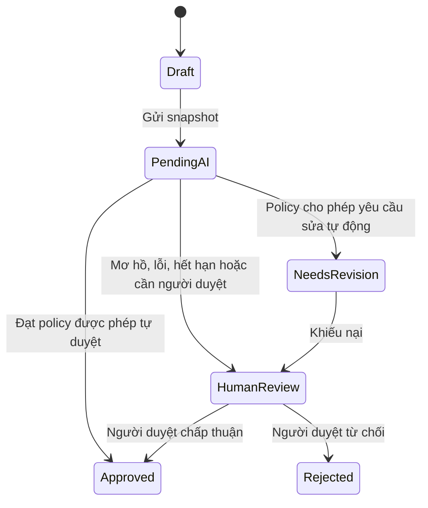

# Các quyết định và lộ trình kiến trúc Vink

**Phiên bản:** 0.5 · **Ngày:** 30/10/2026, cập nhật 03/11/2026, 10/11/2026 và 11/11/2026 · **Trạng thái:** Decision log đề xuất. Không mục nào tự chuyển thành Accepted chỉ vì được viết trong tài liệu này; mục được chủ sản phẩm chốt ghi rõ ngày và phạm vi.

**Cập nhật 10/11/2026:** chủ sản phẩm chốt 15 quyết định nghiệp vụ (`PRODUCT-DECISIONS-20261110`).
[DecisionDelta](product-decisions-20261110.md) ghi luật cũ → luật mới, lựa chọn `DESIGN_PROPOSED`
và các điểm `OPEN`. Trong bảng dưới, “**Hướng sản phẩm đã chốt**” nghĩa là chủ sản phẩm đã chọn
ngữ nghĩa; nó **không** chuyển ADR thành Accepted và không nói runtime đã có. Các đoạn văn cũ được
giữ làm lịch sử; chỗ bị thay có ghi chú ngày. Tra record của DecisionDelta §2–4 và §7.1–7.2 tại
[kho TOML](../../decisions/README.md).

**Cutover 11/11/2026 (#164, CHOICE-07):** quyết định của D-02..D-19 và các `CHOICE` theo issue được
tra tại kho TOML. Bảng §2 chỉ còn trỏ record. D-01, INV-01..08 và S-01..05 vẫn tra cứu tại đây.

## 1. Ba quyết định ảnh hưởng lớn nhất

> **11/11/2026:** Quyết định 1 tra tại `D-02-CONTENT@r1` và `D-02-DISCUSSION@r1`. Quyết định 3 tra
> tại `D-05@r1`. Quyết định 2 chưa có ID riêng và vẫn là đề xuất của sổ này (`pending_review`).
> Các đoạn dưới giữ lý do lịch sử.

### Quyết định 1 — Ai sở hữu tác phẩm?

**Đề xuất:** Vink sở hữu Work/Chapter/Revision/Publication trong PostgreSQL.

**Đã chốt 03/11/2026 (chủ sản phẩm, phần thảo luận):** Vink cũng sở hữu bình luận bằng Rust
core và PostgreSQL của App. Discourse chỉ là nguồn tham khảo thiết kế, API, kiểm duyệt và trải
nghiệm cộng đồng; không là dependency runtime hay nơi lưu bình luận
([ADR ownership](discussion-ownership.md)). Các đoạn dưới đây giữ lý do lịch sử của phần nội dung.

Lợi ích là làm chủ bản nháp song song với bản công khai, quyền xuất bản, tuyển chọn và export. Chi phí là Vink phải xây một màn vận hành tác phẩm riêng và chịu trách nhiệm về revision schema, backup, migration. Đây là lý do chọn B; không dựa trên khẳng định rằng Discourse tuyệt đối không thể mở rộng.

Chỉ chọn A nếu ưu tiên kiểm chứng cộng đồng nhanh hơn các khả năng này và chấp nhận Topic/Post là đơn vị nội dung ban đầu. Nếu B chỉ tận dụng một tập rất nhỏ chức năng Discourse, cần so lại với C trước khi đầu tư bridge sâu.

### Quyết định 2 — Frontend riêng tới mức nào trong beta?

**Đề xuất:** Vink tự làm đọc, soạn, publication và bình luận hai tầng. Theo quyết định 03/11/2026, không có Discourse Admin: Vink phải tự cung cấp màn kiểm duyệt bình luận tối thiểu, báo cáo và khiếu nại trước khi mở bình luận công khai cho pilot.

Không đặt mục tiêu tái tạo toàn bộ profile, notifications, search, badge và history kiểu diễn đàn trong Leptos ngay. Nếu yêu cầu trải nghiệm hoàn toàn thống nhất từ đầu, phải đưa toàn bộ phần UI/API đó vào kế hoạch và chấp nhận khối lượng lớn hơn.

### Quyết định 3 — Ai là nguồn xác thực?

**Đề xuất:** Vink có principal và session độc lập; khảo sát một auth authority được duy trì, với native auth riêng là phương án thay thế cần so bằng thời gian vận hành và UX thực tế. Từ 03/11/2026 không còn bridge DiscourseConnect hay dùng Discourse làm nguồn auth.

Không dùng chung bảng session/password với Cantos. Liên thông audio chưa đòi hỏi SSO; một handoff có sự đồng ý và tài khoản được xác minh có thể đi trước hệ thống đăng nhập chung. Cantos Identity hiện không phải OIDC provider sẵn có cho Vink. [C6]

## 2. Sổ quyết định

Từ 11/11/2026, mỗi D-ID có một authority. D-ID đã chuyển có record riêng trong nhóm nhập
`DECISION-LOG-20261111`. D-ID mà record DecisionDelta đã sở hữu trọn vẹn được giữ làm
`historical_alias` và tra ra các record đó (`related_only`). Lệnh `cargo xtask decision query D-05`
trả record hiện hành. Import chép nguyên văn từ
[sổ tại `73ab92f`](https://github.com/loveoverflowcom/vink/blob/73ab92f0064674833ec31bc7533b210149b26b79/docs/architecture/decisions.md#2-sổ-quyết-định)
và giữ trạng thái nguồn. Cutover không đưa mục nào thành Accepted. Muốn đổi nội dung, viết
proposal rồi chờ signoff. Mốc code, đường production và bằng chứng đã tách khỏi record. Phần này
nằm ở owner trong cột cuối. Disposition từng hàng ở
[bảng kiểm kê](../development/decision-registry-rollout.md#lát-cutover-sổ-dadr-11112026).

<!-- vdr: active D-02-CONTENT@r1 -->
<!-- vdr: active D-02-DISCUSSION@r1 -->
<!-- vdr: active D-03@r1 -->
<!-- vdr: active D-04@r1 -->
<!-- vdr: active D-05@r1 -->
<!-- vdr: active D-08@r1 -->
<!-- vdr: active D-12@r1 -->
<!-- vdr: active D-13@r1 -->
<!-- vdr: active D-14@r1 -->
<!-- vdr: active D-15@r1 -->

| ID | Authority sau cutover | Trạng thái nguồn | Phần đã tách và nơi giữ |
| --- | --- | --- | --- |
| D-01 | Sổ này (`pending_review`): PostgreSQL, database nghiệp vụ độc lập Cantos; giữ nguyên trong mọi phương án | Ràng buộc đầu vào | Format v1 chưa có trạng thái tương ứng với “ràng buộc đầu vào”. Cần chọn cách ghi trước khi chuyển |
| D-02 | `D-02-CONTENT@r1` (content), `D-02-DISCUSSION@r1` (thảo luận) | `DESIGN_PROPOSED` (“Content: đề xuất ưu tiên”); `PRODUCT_CONFIRMED` (“Thảo luận: đã chốt 03/11/2026”) | Bố trí module, trách nhiệm tự xây, rollout: [ADR ownership](discussion-ownership.md) |
| D-03 | `D-03@r1` | `DESIGN_PROPOSED` (“Đề xuất”) | Skeleton và lane: [development](../development/README.md) |
| D-04 | `D-04@r1` | `DESIGN_PROPOSED` (“Cần spike”) | Spike S-01 ở §6 |
| D-05 | `D-05@r1` (auth authority); phương thức đăng nhập ở `USER-08@r2` | `PROVISIONAL` (“Đề xuất A cho pilot (Provisional, 07/11/2026); chưa Accepted”) | Mốc code 10/11, backend #152, đường production và blocker: [ADR](auth-authority.md) §9, §11, §12, [runbook](../development/auth-operations.md), [Auth Web](../development/auth-web.md) |
| D-06 | `USER-02@r1` (`historical_alias`) | `PRODUCT_CONFIRMED` | Runtime chưa có: [đặc tả đích](publication-moderation.md) |
| D-07 | `USER-03@r1`, `USER-05@r1` (`historical_alias`) | `PRODUCT_CONFIRMED` | MOD-06 cho auto-approval production ở [PRD](../../prd/requirements.md). Contract và mock: [moderation-core](../development/moderation-core.md) |
| D-08 | `D-08@r1` (gate sửa công khai); kiểm duyệt bằng trợ lý AI ở `USER-04@r1`; sửa bình luận ở `USER-15@r1` | `DESIGN_PROPOSED` (“Cần spike”) | `premoderation.v1`, chặn sửa và delta `trusted-cohort.v1` (**PROPOSED**): [admission](discussion-admission.md) §5, §8, [sửa bình luận](comment-editing.md), [discussion-core](../development/discussion-core.md) |
| D-09 | `USER-10@r1` (`historical_alias`) | `DEFERRED` | Ví dụ Tạp Chí ở §3 là lịch sử |
| D-10 | `USER-09@r1` (`historical_alias`) | `PRODUCT_CONFIRMED`; WR-04 `DEFERRED` | Tổ chức bài bằng bộ sưu tập: D-16 |
| D-11 | `USER-01@r1` (`historical_alias`) | `DEFERRED` | Mốc M2 ở §7 ghi giả định đã gỡ |
| D-12 | `D-12@r1` (thu hồi đọc, cache/excerpt); bốn trường hợp xóa ở `USER-07@r1`; trang ẩn ở `ADM-07@r1`, `ADM-08@r1` | `DESIGN_PROPOSED` (“Cần chốt policy + spike”) | Retention/purge còn `OPEN` ở `O-08`; mặc định thu hồi ở §5; [đặc tả đích](publication-moderation.md#6-xóa-riêng-tư-gỡ-trang-ẩn-và-tombstone) |
| D-13 | `D-13@r1` | `PRODUCT_CONFIRMED` (“Đã chốt 03/11/2026”) | [ADR §4](discussion-ownership.md#4-quyền-của-tác-giả-tác-phẩm) |
| D-14 | `D-14@r1`; lựa chọn `LVE-PR-01-CHOICE-*`, `LVE-PR-02-03-CHOICE-*`, `LVE-WP-04-CHOICE-10` | `DESIGN_PROPOSED` (“Lựa chọn pure slice LVE-PR-01”) | Đầu vào xếp hạng ở `USER-12`, `USER-13`, `O-06`, `O-07`. Runtime và bằng chứng: [endorsement-core](../development/endorsement-core.md), [runtime](../development/literary-endorsement-runtime.md) |
| D-15 | `D-15@r1`; lựa chọn `TAG-PR-01-CHOICE-01..03` | `DESIGN_PROPOSED` (“Lựa chọn pure slice TAG-PR-01 ngày 08/11/2026, chưa Accepted”) | Hashtag tách khỏi catalog ở `USER-11@r1`. Lựa chọn của #96–#99 ở registry phát triển ([storage](../development/taxonomy-postgres.md), [API](../development/taxonomy-api.md), [discovery](../development/discovery-api.md), [editor](../development/taxonomy-editor.md)) |
| D-16 | `USER-09@r1` (`historical_alias`); `O-01`, `O-02` | `PRODUCT_CONFIRMED`; O-01/02 `OPEN` | [Đặc tả đích](collections.md) |
| D-17 | `USER-11@r1` (`historical_alias`); `PRODUCT-DECISIONS-20261110-CHOICE-04` | `PRODUCT_CONFIRMED`; CHOICE-04 `DESIGN_PROPOSED` | [Đặc tả đích](hashtags.md) |
| D-18 | `USER-12@r1`, `USER-13@r1` (`historical_alias`); `PRODUCT-DECISIONS-20261110-CHOICE-02/03`; công thức ở `O-14` | `PRODUCT_CONFIRMED`; CHOICE-02/03 `DESIGN_PROPOSED`; O-14 `OPEN` | [Đặc tả đích](discovery-ranking.md) |
| D-19 | `USER-06@r1`, `USER-14@r1` (`historical_alias`); `ADM-01..10` | `PRODUCT_CONFIRMED` | Core thuần và model: [moderation-core](../development/moderation-core.md), [đặc tả đích](publication-moderation.md#5-quản-trị-viên-moderator-và-phản-đối) |

Lựa chọn theo issue có ID đầy đủ. Tra bằng `cargo xtask decision query ID` hoặc
`query --domain discussion|endorsement|taxonomy`:

- **Thảo luận #120.** `DISC-01-CHOICE-01` và `DISC-01-CHOICE-06` ([admission](discussion-admission.md)),
  `DISC-02-03-CHOICE-02` ([đọc bình luận](discussion-reads.md)), `DISC-04-CHOICE-01..04`
  ([outbox](discussion-outbox.md)). DISC-04 đánh số theo prompt riêng. `DISC-04-CHOICE-02` là lựa chọn
  cho CHOICE-05 của epic. Ownership D2T-01/D2T-02 là `D-02-DISCUSSION` và `D-13`.
- **Literary endorsement #73.** `LVE-PR-01-CHOICE-01/02/03/08/09/11`, `LVE-PR-02-03-CHOICE-03/04/05/12/13`
  (lát #81) và `LVE-WP-04-CHOICE-10` ([decision owner](literary-endorsement.md)). CHOICE-06 và
  CHOICE-07 còn mở hoặc cần rà.
- **Phân loại #94/#95.** `TAG-PR-01-CHOICE-01..03` ([decision owner](work-taxonomy.md)). Thẻ không cấp
  quyền, không xuất bản hay tuyển chọn.

Hiện trạng và bằng chứng theo lát nằm ở registry phát triển:
[discussion-core](../development/discussion-core.md), [auth-operations](../development/auth-operations.md),
[taxonomy-core](../development/taxonomy-core.md) và [endorsement-core](../development/endorsement-core.md).

## 3. Không dùng một state enum cho toàn bộ vòng đời

Tách các trục sau giúp diễn đạt đúng trạng thái người dùng thấy:

| Trục | Ý nghĩa | Ví dụ |
| --- | --- | --- |
| Working draft | Bản tác giả đang soạn | Version 18 chưa gửi duyệt |
| Revision moderation | Kết luận chính sách cho snapshot bất biến | r2 đang PendingAI, r1 đã Approved |
| Publication | Snapshot đang được phép đọc công khai | Pointer hiện tại là r1, generation 7 |
| Curation | Quyết định giới thiệu một snapshot | r1 từng được chọn; r2 chưa được chọn |
| Audience/access | Ai có quyền đọc tại thời điểm hiện tại | Nháp riêng, public publication; rút bài đóng public read |
| Job/integration | Tiến độ xử lý kỹ thuật | Retry AI, đang tạo thread, remote cleanup pending |

`Approved` là đủ điều kiện theo một quyết định; `Published` là kết quả của hành động công khai có quyền và ý định tác giả. Job thành công không tự quyết định publication.

### Máy trạng thái kiểm duyệt ở mức khái niệm

```mermaid
stateDiagram-v2
    direction TB
    [*] --> Draft
    Draft --> PendingAI: Gửi snapshot
    PendingAI --> Approved: Đạt policy được phép tự duyệt
    PendingAI --> NeedsRevision: Policy cho phép yêu cầu sửa tự động
    PendingAI --> HumanReview: Mơ hồ, lỗi, hết hạn hoặc cần người duyệt
    NeedsRevision --> HumanReview: Khiếu nại
    HumanReview --> Approved: Người duyệt chấp thuận
    HumanReview --> Rejected: Người duyệt từ chối
```

Sơ đồ mô tả luồng, không phải file Quint đã thực thi. Trong pilot AI chỉ tư vấn, cả kết quả rõ và mơ hồ đều đi HumanReview kèm gợi ý; AI không tự áp quyết định cuối. **10/11/2026:** câu “AI chỉ tư vấn” bị thay bởi D-07/D-19: kết quả hợp lệ của trợ lý AI có thể là quyết định; `HumanReview` nay là “cần quản trị viên xem xét”, không hàm ý có người đang trực. Đặc tả thực thi của luồng đích là [`publication.qnt`](../../services/vink-app/behavior/publication/publication.qnt) (#150 có lõi publication thuần và replay theo phạm vi; evaluator/admin runtime chưa có). Chỉnh nội dung sau submit tạo snapshot mới; không biến một revision bất biến về Draft rồi sửa tại chỗ. Mọi phương án hủy, gửi lại và mở lại quyết định cần audit và version guard khi triển khai.

### Guard khi xuất bản

Một publish command chỉ có hiệu lực khi đúng snapshot/hash đã được duyệt, người thực hiện còn quyền, có ý định xuất bản phù hợp, access/withdrawal gate cho phép và expected publication generation vẫn khớp. Giao dịch ghi pointer, receipt/audit và outbox cùng lúc.

Để giữ UX gọn, nút “Gửi để đăng khi được duyệt” có thể lưu trước ý định xuất bản cho đúng snapshot. Khi được duyệt, application vẫn phải kiểm lại các guard; tác giả đã rút yêu cầu hoặc publication đã tiến sang phiên bản khác thì không tự đăng tiếp.

### Ví dụ cần giữ đúng

Cột “Tạp Chí thấy” được giữ làm lịch sử (D-09 `DEFERRED` 10/11/2026). Dòng “Tác giả rút tác phẩm”
nay tách thành xóa/riêng tư/gỡ theo PUB-04/05.

| Sự kiện | Người đọc Xưởng thấy | Tạp Chí thấy |
| --- | --- | --- |
| r1 đã công khai và được tuyển | r1 | r1 |
| Tác giả sửa r2, r2 đang chờ | r1 | r1 |
| r2 bị yêu cầu sửa/từ chối | r1 | r1 |
| r2 được duyệt nhưng chưa có publish intent hợp lệ | r1 | r1 |
| r2 được xuất bản thay r1 | r2 | Mục tuyển chọn tạm ngừng; chờ biên tập chọn r2 |
| Tác giả rút tác phẩm | Không trả văn bản công khai tại Vink | Không hiển thị tuyển chọn; xử lý các bản sao theo policy thu hồi |

Pilot chưa mở kho phiên bản công khai. Lịch sử revision và quyết định tuyển chọn vẫn được giữ theo quyền/retention đã chốt. Cách tách editing head và publication có điểm tương đồng với ADR 0054 của Cantos, nhưng thiết kế và mức hoàn thiện của Vink được quyết định riêng. [C7]

## 4. Các bất biến và giới hạn kiểm chứng

| ID | Thuộc tính cần giữ | Bằng chứng cần có |
| --- | --- | --- |
| INV-01 | Public read chỉ trả snapshot có quyết định phù hợp, ý định xuất bản và access gate hiện tại | Model/pure tests + API/SSR/search tests |
| INV-02 | Sửa/chờ/từ chối r2 không thay publication r1 | Model + PostgreSQL transaction/concurrency test |
| INV-03 | Callback cũ/sai hash không thắng decision hoặc generation mới | Model + worker lease/version tests |
| INV-04 | Curation không tự chuyển sang revision mới; mất quyền hiển thị thì không được đọc qua tuyển tập | Model + query/UI tests |
| INV-05 | Client không chọn thay identity hoặc quyền người khác | Auth/API integration tests; không chỉ model giả định actor hợp lệ |
| INV-06 | Một subject có một thread discussion hữu hiệu; retry không tạo thread ngoài kiểm soát | Unique constraint + PostgreSQL concurrent/retry test |
| INV-07 | Publish event cũ không khôi phục nội dung đã rút | Subject generation kiểm tại commit; projection/cache có fencing hoặc kiểm quyền khi đọc |
| INV-08 | Nháp riêng không lọt vào public DTO/cache/provider ngoài scope | Review data flow + integration/browser tests |

INV-01..08 không đổi sau quyết định 10/11/2026. Các model đích ở
[`behavior/target`](../../services/vink-app/behavior/target/README.md) đặt tên invariant riêng và
dẫn về các INV này trong [registry](../development/product-decisions-registry.md); chúng là bằng
chứng **model**, chưa phải bằng chứng code hay PostgreSQL.

**Tiến triển cần điều kiện vận hành:** PendingAI phải được worker/watchdog đẩy tiếp khi retry/deadline hết; HumanReview phải có người phụ trách và khung xử lý được thông báo. Một queue có dữ liệu không chứng minh rằng người dùng sẽ được giải quyết. Thời gian chờ là chỉ số cần đo trong pilot.

Quint phân biệt safety và liveness; liveness thường cần temporal properties và giả định fairness. Model chỉ có giá trị trong phạm vi đã mô tả và phương pháp chạy được ghi lại. Không dùng câu “đã chứng minh không bao giờ lỗi” cho code hay PostgreSQL chỉ vì simulation PASS. [T8], [C8]

## 5. Quyết định về thu hồi và đồng bộ cần viết rõ

**10/11/2026:** mặc định dưới đây nay áp cho **chuyển riêng tư** và **gỡ do kiểm duyệt**. Khi
tác giả **xóa** bài đang công khai, nội dung và mọi preview do hệ thống sinh bị đóng nhưng URL cũ
giữ trang thay thế và các bình luận hợp lệ (PUB-04/05, [đặc tả đích](publication-moderation.md#6-xóa-riêng-tư-gỡ-trang-ẩn-và-tombstone)).

**Mặc định đề xuất cho pilot:** rút bài đóng ngay public read ở Vink, kể cả thảo luận của tác
phẩm: vì thảo luận nay cùng owner và cùng database (quyết định 03/11/2026), đường đọc/ghi bình
luận kiểm trạng thái publication hiện hành tại thời điểm đọc và tại commit, không chờ event.
Bình luận được giữ nguyên để đối soát và khôi phục theo policy; không xóa hàng loạt.

Excerpt, trích dẫn trong replies, preview, thông báo đã gửi và cache là các bề mặt khác nhau,
cần policy riêng. Projection/cache phải kiểm quyền hiện hành khi đọc hoặc bị vô hiệu theo
generation; xóa một bản cache không tự chứng minh mọi bản sao đã được thu hồi.

Mỗi subject cần generation tăng dần và desired state bền vững. Worker xử lý projection/thông
báo đọc lại desired state trước side effect và đối soát sau; side effect ra ngoài hệ thống
(email, push) không được coi là exactly-once. Thời hạn thu hồi các bản sao ngoài Vink và cách xử
lý khi quá hạn cần chủ sản phẩm chốt trước public beta.

## 6. Năm thử nghiệm cần làm trước khi chốt stack

| Spike | Câu hỏi cần trả lời | Đầu ra và tiêu chí go/no-go |
| --- | --- | --- |
| S-01 Editor + SSR | Leptos và editor có cho trải nghiệm viết tiếng Việt tốt không? | Demo có thơ/tản văn, IME, paste, undo, autosave, hai tab, refresh và mobile; schema round-trip; public HTML/metadata đúng. Nếu không đạt, thử editor/frontend thay thế trước khi xây nhiều màn |
| S-02 Tiền kiểm bình luận | ~~Discourse moderation~~ — thay ngày 03/11/2026 bằng tiền kiểm trong module thảo luận Vink | Mọi đường ghi (Web/API/staff) tạo bình luận chờ duyệt; quyết định gắn version; list/count/preview/thông báo không lộ pending; quyết định trễ không thắng; có người trực hàng đợi |
| S-03 Identity | Map người và quyền mà không mở lỗ hổng đăng thay được không? | Thử signup/verified email, account đã có, đổi email/username, provisioning lỗi, logout/ban, request giả user; quyết định auth authority và authority cho suspension |
| S-04 Đồng bộ + dữ liệu | Có sống sót qua crash/replay/withdraw/restore không? | PostgreSQL transaction và CAS; lệnh ghi bình luận mất acknowledgment; publish/withdraw đến sai thứ tự; remote cleanup thất bại; restore và reconcile giữ đúng dữ liệu/quyền |
| S-05 AI + vận hành | Tự động hóa mức nào giảm việc mà không làm hại vòng phản hồi? | Bộ mẫu tiếng Việt, schema output, thử injection/timeout, cost baseline, false positives, tuổi human queue; chốt nhóm auto-approve và cách tắt/đảo quyết định |

Ngày 02/11/2026, theo yêu cầu của người dùng, PostgreSQL được tách theo owner và Identity thành process riêng chưa có authority ([ranh giới PostgreSQL/Identity](identity-postgres-boundaries.md)). Đó là ranh giới kiến trúc, không phải lựa chọn auth authority.

Ngày 07/11/2026 spike S-03 ([ADR D-05](auth-authority.md), [bằng chứng](../development/auth-authority-s03-evidence.md)) so ba hướng (native Rust, Keycloak, Supabase/Clerk) và hiện thực hướng native trên ranh giới đó: tài khoản/mã/phiên ở Identity, binding và đình chỉ ở App, kiểm bằng PostgreSQL thật và hai binary thật. Phần “thử signup/verified email, account đã có, đổi email/username, provisioning lỗi, logout/ban, request giả user” đã có bằng chứng cục bộ; authority cho suspension là App (đình chỉ principal) cộng Identity (disable tài khoản). S-03 **chưa hoàn tất ở mức production**: không có mail transport, rate limit biên, trình duyệt thật hay native.

Skeleton ngày 30/10/2026 ([docs/development](../development/README.md)) dùng Hybrid B, một app Rust + worker và Leptos SSR làm giả định bootstrap. Nó cung cấp chỗ thử cho S-01, S-03 và S-04 (textarea, seam identity, CAS bản nháp trên PostgreSQL) nhưng không hoàn tất spike nào và không đổi trạng thái D-02–D-12.

Mỗi spike cần ghi phiên bản, môi trường, kịch bản, kết quả quan sát, giới hạn và quyết định tiếp theo. Không cần xây một sản phẩm hoàn chỉnh để thử, nhưng demo “happy path” duy nhất chưa đủ để chốt B.

## 7. Lộ trình theo điều kiện hoàn thành

| Mốc | Sản phẩm bàn giao | Điều kiện chuyển mốc |
| --- | --- | --- |
| M0 — Nền tảng quyết định | Bộ vision/stack/requirements này và chủ sở hữu review | Xác định nhóm beta, content ownership, UI boundary và auth direction |
| M1 — Luồng xuyên suốt | Một tác phẩm thật đi từ editor tới publication và discussion | S-01–S-04 có bằng chứng đủ; không lộ nháp, không đăng nhầm bản, có admin tối thiểu |
| M2 — Pilot có mời (10/11/2026: không còn giả định 18+ theo lời mời hay người trực hàng đợi; D-11 `DEFERRED`, MOD-08) | Nhóm nhỏ viết/đọc/góp ý; AI hỗ trợ; người trực hàng đợi | Quan sát chất lượng phản hồi, thời gian chờ, lỗi editor, chi phí; có export/restore thử |
| M3 — Public beta | Phạm vi đã chốt, quy tắc công khai, vận hành có người chịu trách nhiệm | MOD-06 nếu mở auto-approval; budgets, privacy/age, withdrawal policy và compatibility matrix được chấp nhận |
| M4 — Mở rộng | Nhiều chương nâng cao, margin notes, coach, Cantos handoff theo nhu cầu | Mỗi phần có usage case, owner, quyền dữ liệu và thử nghiệm riêng |

Không ấn định số tuần hoặc ngày ra mắt trước khi biết số người vận hành, phạm vi UI headless và kết quả spike. Với đội nhỏ, giảm phạm vi chức năng trước khi giảm các bảo đảm về bản thảo, quyền và xuất bản đúng phiên bản.

## 8. Những tài liệu nên viết sau bộ này

Sau review/spikes: ADR content ownership và identity; schema tài liệu editor và migration strategy; API contracts/fixtures; publication/moderation transition rules; một hoặc hai model Quint tập trung; runbook moderation/backup/restore. Mỗi tài liệu gắn với quyết định đã chốt, tránh sinh đồng thời một bộ đặc tả lớn chưa có cơ sở.

[C6]: https://github.com/loveoverflowcom/cantos/blob/a8e2b6f40b58e0e72a2bdab2d4f44240cb6a0330/services/cantos-server/contracts/auth/identity-auth/v1/README.md
[C7]: https://github.com/loveoverflowcom/cantos/blob/a8e2b6f40b58e0e72a2bdab2d4f44240cb6a0330/docs/decisions/0054-publication-generation-and-access.md
[C8]: https://github.com/loveoverflowcom/cantos/blob/a8e2b6f40b58e0e72a2bdab2d4f44240cb6a0330/docs/decisions/0027-quint-executable-behavior.md
[T8]: https://quint.sh/docs/checking-properties
